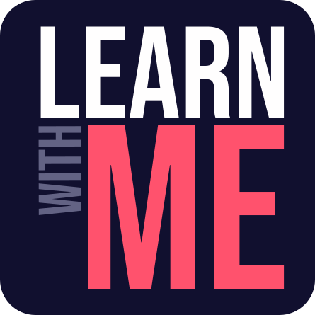

    

# Learn with Me - API

Compartilhe seus estudos e aprenda com outras pessoas.

**Learn with Me** tem como objetivo conectar e ajudar pessoas a estudarem através de conteúdos gratuitos na internet compartilhados por outros usuários de forma estruturada e didática. Venha estudar com a comunidade do **Learn with Me** também! 😉

Projeto desenvolvido para o MVP na Sprint 1 da Pós Graduação de Engenharia de Software da PUC-Rio.

## Como executar